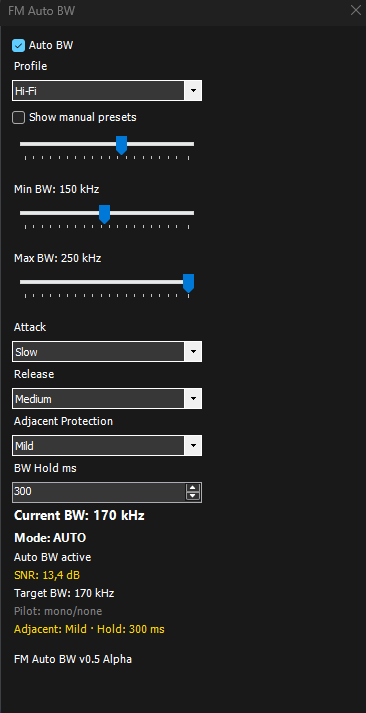

# SDRSharp FM Auto BW

> TEF6686-inspired adaptive FM bandwidth plugin for SDR#

Adaptive WFM bandwidth control designed especially for FM-DXing with Airspy HF+ receivers and SDR#.

---

## Features

✅ Adaptive FM bandwidth control  
✅ SNR-driven Auto BW engine  
✅ Stereo pilot aware filtering  
✅ Adjustable Attack / Release behavior  
✅ Min / Max bandwidth limits  
✅ FM-DX optimized profiles  
✅ WFM-only safe mode  
✅ Manual override controls  
✅ Lightweight SDR# native UI  

---

## Profiles

| Profile | Purpose |
|---|---|
| Es DX | Aggressive adaptive behavior for Sporadic-E |
| Tropo | Stable long-duration enhancement behavior |
| RDS Logging | Optimized for weak PI/RDS decoding |
| Hi-Fi | Wider bandwidth for listening quality |

---

## Why Adaptive Bandwidth?

Traditional SDR FM listening uses a fixed WFM filter width.

During real FM-DX conditions:
- signal strength changes rapidly
- adjacent channel interference changes constantly
- stereo/mono transitions happen dynamically

TEF6686 tuners became popular among FM DXers because their adaptive bandwidth behavior reacts automatically to changing RF conditions.

This plugin brings similar concepts into SDR#.

---

## Current Adaptive Logic

The current alpha uses:

- Visual SNR
- Stereo pilot detection
- Attack / Release smoothing
- Adjustable bandwidth limits
- FM-DX behavior profiles

Stereo signals may automatically allow slightly wider bandwidth, while weak mono signals can force narrower filtering for improved DX performance.

---

## Screenshot

---

## Requirements

- SDR# Studio
- Windows
- SDR# Plugin API support

Recommended SDRs:
- Airspy HF+
- Airspy HF+ Discovery
- Airspy Mini

---

## Status

🚧 Early Alpha Release

Algorithms and behavior will continue evolving through real-world FM-DX testing during Es and tropo conditions.

---

## Planned Features

- Adjacent channel intelligence
- Spectrum-aware adaptive filtering
- Advanced damping logic
- Preset saving
- Per-profile custom settings
- Optional logging/debug mode

---

## Inspiration

Inspired by:
- TEF6686 adaptive bandwidth behavior
- FM-DX community experimentation
- Sjef Verhoeven (PE5PVB)
- Airspy SDR ecosystem

---

## Disclaimer

Experimental software intended primarily for FM-DX hobby use.
